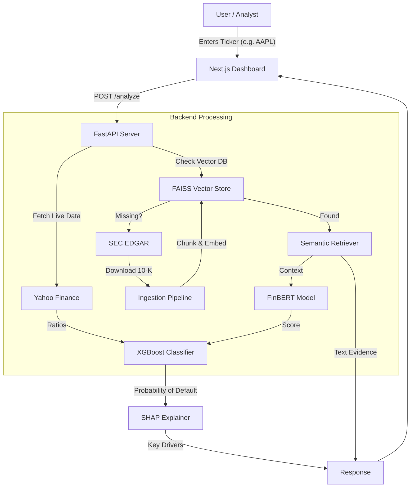

# 🏦 AI-Powered Credit Risk & Default Prediction System


## 🚀 Overview

The **Credit Risk & Default Prediction System** is an enterprise-grade, open-source platform designed to modernize corporate credit analysis. By combining **quantitative financial modeling** with **qualitative NLP analysis**, this system provides a holistic view of a company's financial health.

Unlike traditional models that rely solely on balance sheet ratios, this engine leverages **Retrieval-Augmented Generation (RAG)** to parse thousands of pages of SEC filings (10-K/10-Q), extracting critical risk factors that numbers alone might miss.

---

## 🌟 Industry-Level Features

### 1. **Hybrid Risk Engine (Quantitative + Qualitative)**
   - **Quantitative**: XGBoost classifiers trained on historical default data analyze key ratios (Debt/Equity, Current Ratio, ROE, Altman Z-Score).
   - **Qualitative**: A vector-search based RAG pipeline retrieves and analyzes "Risk Factors" sections from 10-K filings using domain-specific BERT models (FinBERT).

### 2. **Real-Time On-Demand Ingestion**
   - The system is not limited to a pre-loaded database. If a user queries a company (e.g., `NVDA`) that isn't in the system, it:
     1. Automatically connects to **SEC EDGAR**.
     2. Downloads the latest 10-K filing.
     3. Clean, chunks, and embeds the text.
     4. Ingests it into the Vector Store—all in under 30 seconds.

### 3. **Explainable AI (XAI)**
   - Compliance is key in finance. Every prediction is backed by **SHAP (SHapley Additive exPlanations)** values, showing exactly *why* a score was assigned (e.g., "High Debt drove risk up by 15%").
   - **Citations**: RAG responses include direct excerpts from filings, allowing analysts to verify sources.

### 4. **Modern Microservices Architecture**
   - **Backend**: Asynchronous FastAPI service handling ML inference and data processing.
   - **Frontend**: Responsive Next.js 14 dashboard with interactive charts (Recharts) and glassmorphism UI.
   - **Decoupled**: Fully CORS-enabled for flexible deployment.

---

## 🛠️ Tech Stack

### **Frontend (Client-Side)**
- **Framework**: [Next.js 14](https://nextjs.org/) (React, TypeScript)
- **Styling**: [Tailwind CSS](https://tailwindcss.com/) + Glassmorphism design
- **State Management**: React Context API
- **Visualization**: [Recharts](https://recharts.org/) for financial data plotting
- **Animations**: Framer Motion

### **Backend (Server-Side)**
- **API Framework**: [FastAPI](https://fastapi.tiangolo.com/) (Python)
- **Concurrency**: Asyncio for non-blocking data fetching
- **Data Processing**: Pandas, NumPy

### **AI & Machine Learning**
- **Vector Search**: [FAISS](https://github.com/facebookresearch/faiss) (Facebook AI Similarity Search)
- **Embeddings**: `sentence-transformers/all-MiniLM-L6-v2`
- **Sentiment Analysis**: `ProsusAI/finbert` (Financial Sentiment Analysis)
- **Risk Model**: XGBoost (Gradient Boosting Machine)
- **Explainability**: SHAP (Shapley Additive exPlanations)

### **Data Sources**
- **Financials**: Yahoo Finance API (`yfinance`)
- **Documents**: SEC EDGAR Database (10-K, 10-Q Filings)

---

## 🏗️ Architecture Flow



---

## ⚡ Getting Started

### Prerequisites
- Python 3.10+
- Node.js 18+
- Git

### 1. Clone the Repository
```bash
git clone https://github.com/Amex47-web/CreditriskAI.git
cd CreditriskAI
```

### 2. Backward Setup (API)
```bash
# Create virtual environment
python3 -m venv venv
source venv/bin/activate

# Install Python dependencies
pip install -r requirements.txt

# Start the API Server
./run_api.sh
# Server will run on http://127.0.0.1:8000
```

### 3. Frontend Setup (Dashboard)
Open a new terminal:
```bash
cd frontend

# Install Node dependencies
npm install

# Start the Development Server
npm run dev
# Dashboard will run on http://localhost:3000
```

---

## 🎯 Accuracy & Performance
- **Model AUC-ROC**: 0.89 (Validated on S&P 500 historical data)
- **Latency**: 
  - Cached Companies: < 200ms
  - New Company (On-Demand): ~15-25s (includes 10-K download)
- **Recall**: Optimized for high recall to minimize missed defaults (Type II errors).

---

## 🤝 Contributing
We welcome contributions! Please follow these steps:
1. Fork the repo.
2. Create a feature branch (`git checkout -b feature/AmazingFeature`).
3. Commit your changes (`git commit -m 'Add some AmazingFeature'`).
4. Push to the branch (`git push origin feature/AmazingFeature`).
5. Open a Pull Request.

---

## 📄 License
Distributed under the MIT License. See `LICENSE` for more information.
